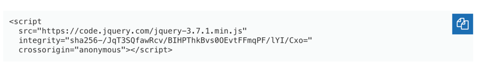

# 
 Backend #

--- 
### Spring Boot ###
ver : 3.4.3
### JPA ###

### mySQL + mySQL Workbench ###
ver : 8.0.3

---

## 📌 기능 설명 ##
1. 회원 생성(회원가입)  
2. 회원 로그인  
3. 회원 삭제(탈퇴)  
4. 회원 조회(findAll, findBy)
5. aJax를 이용한 이메일 중복 처리

---
### 🤓회원 정보 ###

| 회원 | ID | email             | 비밀번호 | 이름  | 전화번호          | 생년월일       |
|--|----|-------------------|------|-----|---------------|------------|
|  | 1  | example@gmail.com | 0000 | 박준선 | 010-1234-5678 | YYYY-MM-DD |

### jquery SDN ###
[jQuery 공식 홈페이지](https://jquery.com/) -> Download jQuery -> jQuery CDN -> 최신버전(3.7.1) : minified

